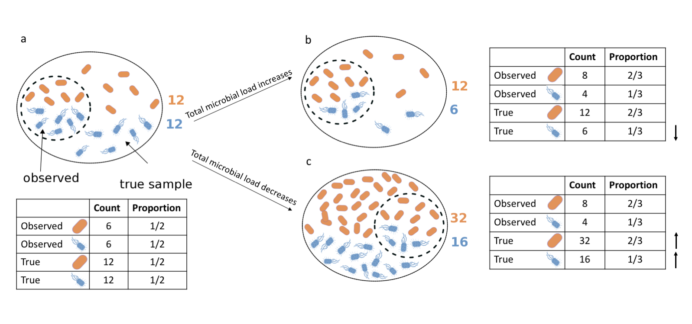

# Differential abundance

## Motivation

Differential abundance is a core technique in every microbiome application.  If a large microbial difference is detected between different environments, the next step is to identify microbes that explain the differences between these environments.  However, this problem can be tricky to answer due to the relative nature of the data that we measured.

## Compositional effects

The main issue behind differential abundance is compositionality, the mathematical nature of relative measurements.
Consider the example below



In the left environment we don't observe the entire environment, but we can count the number of blue and orange microbes.
If there is a major perturbation, and we again count the microbes, there are multiple possibilities that could have explained the difference of proportions between the two environments. One possibility is that the number of blue microbes decreased.  Another possibility is that both the number of blue and orange microbes increased.  The takeaway is that it is not possible infer which microbe abundances have been altered, because it is not possible to infer absolute changes from relative data.

But fear not. While we often cannot infer the absolute change, we can definitely infer the relative changes (which we call the differential).  The ordering of the log fold change is consistent between absolute and relative abundances.   If we have environment $A = (a_1, ... a_D)$ with proportions from $D$ taxa and the perturbed environment $B = (b_1, ... b_D)$, then the following holds.

$$
rank(\frac{A}{B}) = rank(\frac{N_A \times p_A}{N_B \times p_B}) = rank(\frac{p_A}{p_B})
$$

Here, the total biomass does not influence the ordering of the log fold change calculation. As a result, the ranking of the log fold change between the proportions is equal to the ranking of the log fold change between the absolute abundances. This is a huge win for differential abundance methodologies, since many methods can already infer the differential.  The major outstanding issue is how to determine which microbes to focus on.  Since the total biomass fluctuation will confound the absolute log fold change estimates, it won't be possible to build a statistical test to determine if a microbe's abundance has changed or not.

One statistical test that can definitely be done is by testing log ratios of microbes, because if we take the log ratio of two microbes, the total biomass cancels out.

$$
\frac{a_i}{a_j} = \frac{p_{a_i}}{p_{a_j}}
$$

As a result, we can conduct a statistical test to determine if the log ratio of pairs of microbes have been altered across conditions. More information these concepts can be found in our paper [here](https://www.nature.com/articles/s41467-019-10656-5)

In this tutorial, we will first demonstrate how to run a basic differential abundance analysis using multinomial regression via songbird. The we will show how to interpret the underlying differentials estimated from songbird.


## Setup
We'll be using the moving picture tutorial data for demonstration.  If you haven't already, download those files using the following commands.

Download Feature Table
`wget https://docs.qiime2.org/2019.7/data/tutorials/moving-pictures/table.qza`

Download Sample metadata
`wget https://data.qiime2.org/2019.7/tutorials/moving-pictures/sample_metadata.tsv`

Download Taxonomy
`wget https://docs.qiime2.org/2019.7/data/tutorials/moving-pictures/taxonomy.qza`


## Running Songbird

Once the tables are downloaded, we can now run the basic multinomial regression command

```
qiime songbird multinomial \
    --i-table table.qza \
    --m-metadata-file sample-metadata.txt \
    --p-formula "subject + body_site" \
    --p-epochs 10000 \
    --p-summary-interval 1 \
    --o-differentials differentials.qza \
    --o-regression-stats regression-stats.qza \
    --o-regression-biplot regression-biplot.qza
```


```
qiime songbird summarize-single \
    --i-regression-stats regression-stats.qza \
    --o-visualization regression-summary.qzv
```

The `regression-summary.qzv` can be downloaded and directly visualized in (view.qiime2.org)[https://view.qiime2.org/].
The top plot corresponds to cross-validation accuracy.  The bottom plot corresponds to overall model fit.

The raw differentials can be viewed as a table using the following command.

```
qiime metadata tabulate \
    --m-input-file differentials.qza \
    --o-visualization differentials-viz.qzv
```

The `differentials-viz.qzv` can be viewed in (view.qiime2.org)[https://view.qiime2.org/].

In addition, the differentials can be unpacked as follows

```
qiime tools export differentials.qza
```

The resulting text file can be viewed in your favorite spreadsheet program.

Finally, this differential abundance analysis can be readily visualized using qurro

```
qiime qurro differential-plot \
    --i-ranks differentials.qza \
    --i-table table.qza \
    --m-sample-metadata sample-metadata.txt \
    --m-feature-metadata taxonomy.tsv \
    --o-visualization qurro-viz.qzv
```

The `differentials-viz.qzv` can be viewed in (view.qiime2.org)[https://view.qiime2.org/].


## Considerations

The workflow presented here is designed to be easy to understand and use.  However, note that there are still limitations.
First, while we can pick pairs of microbes of interest, intelligently choosing interesting microbes is still a challenging task.
It is still possible have issues with false discovery rate.

Furthermore, differential abundance is not a replacement for beta diversity - if there isn't a notable trend in beta diversity, then one shouldn't expect meaningful results in the differential abundance analysis.

Finally, the multinomial model does not account for overdispersion, so some of the differentials, particularly low abundance taxa maybe still unreliable.


## Other tools

It is worth noting that differentials can be properly computed by many other differential abundance tools such as aldex2, corncob and DESeq2.  The main question up for debate is whether or not microbe can be detected to be significantly changed or not.

## References

Morton, J.T., Marotz, C., Washburne, A., Silverman, J., Zaramela, L.S., Edlund, A., Zengler, K. and Knight, R., 2019. Establishing microbial composition measurement standards with reference frames. Nature communications, 10(1), p.2719.
